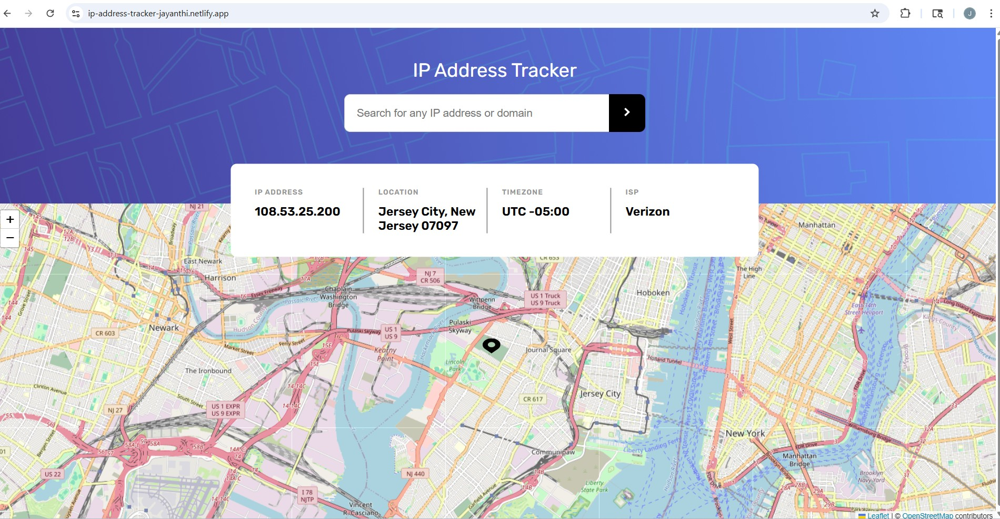

                                          IP Address Tracker

IP Address Tracker is a web application that allows users to track IP addresses and display their location on an interactive map. Built with HTML, CSS, JavaScript, and Leaflet.js, it fetches data from the IPify API and displays the IP address, location, timezone, and ISP. The map updates dynamically for the searched IP or the user’s current IP on page load.

Live Demo: (https://ip-address-tracker-jayanthi.netlify.app/)

Features:

- Track user’s IP address automatically on page load
- Search for any valid IPv4 address
- Display detailed IP information: IP, location (city, region, postal code), timezone, and ISP
- Interactive map using Leaflet.js with a custom marker
- Mobile-responsive map and layout
- API key security: generated dynamically at build time using make-secret.js

Setup:

1. Clone the repository
2. Set the API key:
   - Netlify deployment: Add IP_API_KEY in Site Settings → Build & deploy → Environment variables
   - Local testing: Run make-secret.js with your API key to generate secret.js
3. Ensure netlify.toml is in the repo root with:

          [build]
          command = "node ip-address-tracker-master/scripts/make-secret.js"
          publish = "ip-address-tracker-master"

Usage:

 - Open the website → Current IP location is displayed
 - Enter a valid IP address → map and details update dynamically

Notes:

- The API key is never committed to GitHub and is only injected at build time
- Uses Leaflet.js for interactive maps and supports mobile screens
- Custom error handling for network or API issues